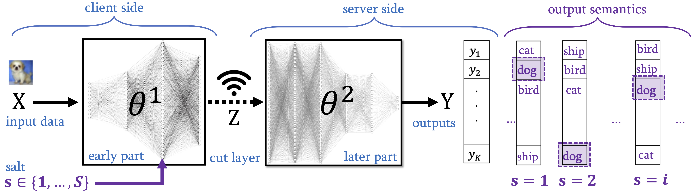
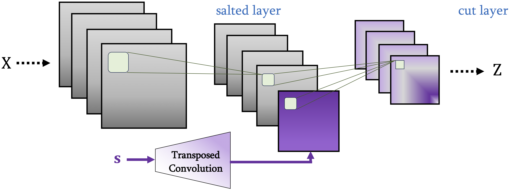

# Salted DNNs
## [HotMobile'24] Salted Inference: Enhancing Privacy while Maintaining Efficiency of Split Inference in Mobile Computing
**• Paper**: https://arxiv.org/abs/2310.13384

**• Abstract**:

Split inference partitions a deep neural network (DNN) to run the early part at the edge and the later part in the cloud. This meets two key requirements for on-device machine learning: input privacy and compute efficiency. Still, an open question in split inference is output privacy, given that the output of a DNN is visible to the cloud. While encrypted computing can protect output privacy, it mandates extensive computation and communication resources. In this paper, we introduce “Salted DNNs”: a novel method that lets clients control the semantic interpretation of DNN output at inference time while maintaining accuracy and efficiency very close to that of a standard DNN. Experimental evaluations conducted on both image and sensor data show that Salted DNNs achieve classification accuracy very close to standard DNNs, particularly when the salted layer is positioned within the early part to meet the requirements of split inference. Our method is general and can be applied to various DNNs. Here, we open-source our code and results, as a benchmark for future studies.





# How to Run Experiments

Set up the arguments of your desired experiment in `exp_setup.py` and then run
```
> python main.py 
```


# Citation
Please use:
```bibtex
@inproceedings{malekzadeh2024salted,
  title={Salted Inference: Enhancing Privacy while Maintaining Efficiency of Split Inference in Mobile Computing},
  author = {Mohammad Malekzadeh and Fahim Kawsar},
  booktitle={Proceedings of the 25th International Workshop on Mobile Computing Systems and Applications},
  year={2024}
}
```
